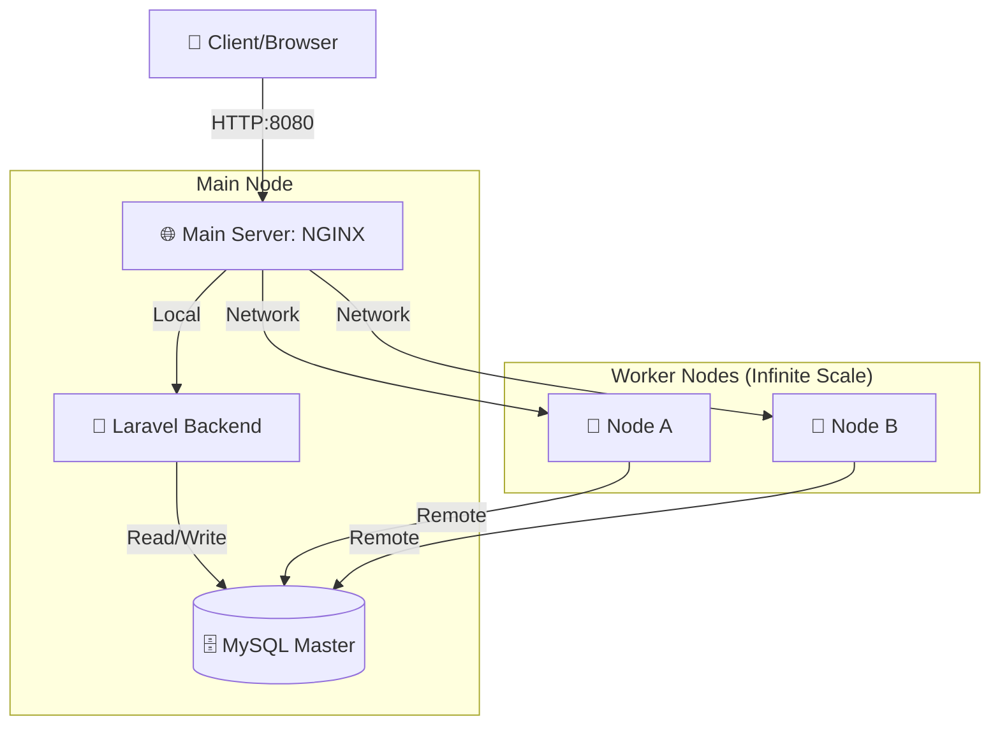
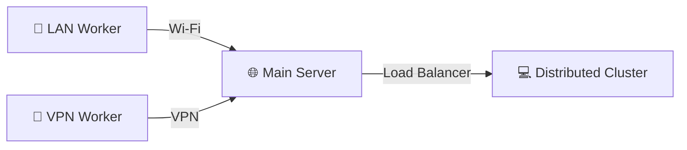

# 🌐 Distributed System Simulation: Laravel API + NGINX + MySQL


A high-performance, multi-node distributed system simulation. This project automates the setup of a Load Balancer cluster, allowing multiple physical or virtual machines to collaborate as single, scalable API.

---

## ✨ Key Features

- **🚀 Auto-Discovery**: Nodes join the cluster automatically with a single command.
- **🌐 Network Bridging**: Simultaneously supports Local LAN and VPN (Tailscale/Hamachi) traffic.
- **⚖️ Dynamic Load Balancing**: Real-time Nginx reconfiguration using Round-Robin.
- **🛡️ Fault Tolerance**: Automatic health checks and node failover.
- **📊 Real-time Monitoring**: Built-in Nginx status tracking.

## 🏗️ System Architecture



---

## 📂 Project Structure

```text
laravel-api/
├── app/                   # Business Logic & Controllers
├── infrastructure/
│   ├── nginx/             # Nginx templates & runtime config
│   └── scripts/           # PowerShell Automation (init.ps1)
├── compose.yml            # Main Server Cluster Setup
└── compose.backend.yml    # Distributable Worker Setup
```

---

## 🚀 Setup Guide

### 1️⃣ Main Server (The Hub)
The Main Server hosts the Database and the Load Balancer.

1. **Initialize**:
   ```powershell
   .\infrastructure\scripts\init.ps1
   ```
2. **Launch**:
   ```bash
   docker compose up -d
   ```

### 2️⃣ Worker Nodes (The Power)
Run this on any other laptop in the same Wi-Fi or VPN.

1. **Synchronize**:
   ```powershell
   .\infrastructure\scripts\init.ps1 -Join <MAIN_SERVER_IP>
   ```
2. **Execute**:
   ```bash
   docker compose -f compose.backend.yml up -d
   ```

---

## 🌐 Hybrid Networking (LAN + VPN Bridge)

The system acts as a **Network Bridge**. If the Main Server is connected to both a local Wi-Fi and a VPN (e.g., Tailscale), it can serve workers from both networks simultaneously.

### 🏗️ Bridging Logic


### 📋 Setup Steps for Hybrid Mode

1. **Connect Main Server**: Ensure the Main Server is active on both networks.
2. **Identify IPs**: Run `.\infrastructure\scripts\init.ps1` to see all available IPs.
3. **Workers Join**: 
   - LAN friends join via your LAN IP: `.\init.ps1 -Join <LAN_IP>`
   - Remote friends join via your VPN IP: `.\init.ps1 -Join <VPN_IP>`

---

## 🔌 Testing Scenarios

- **Load Balance**: `GET /api/data` - Watch the `server` ID change.
- **Concurrency**: `GET /api/slow/{id}` - Hit 5 tabs at once to see multi-threaded processing.
- **Status**: `GET /nginx_status` - Monitor active connections.

## 🛠️ Restoration Guide (No-Starter-Kit)

If you need to restore frontend assets without installing heavy boilerplate (Breeze/Jetstream):

```bash
# Restore from history
git checkout main -- vite.config.js resources/css/ resources/js/ package.json

# Re-init manually
npm install -D vite laravel-vite-plugin

---

## 📖 Additional Docs

- **[Changelog](CHANGELOG.md)**: View the full history of changes.
- **[Manual Setup Guide](docs/LEGACY_SETUP.md)**: Original manual configuration steps (v1.0.0).

---
*Distributed System Simulation v1.0.0*
